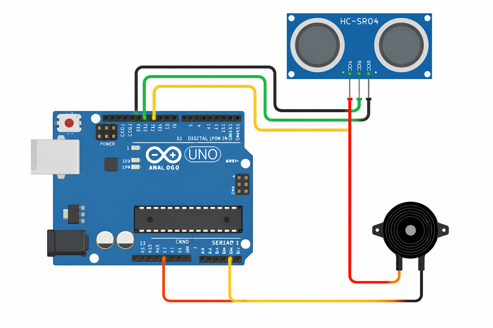
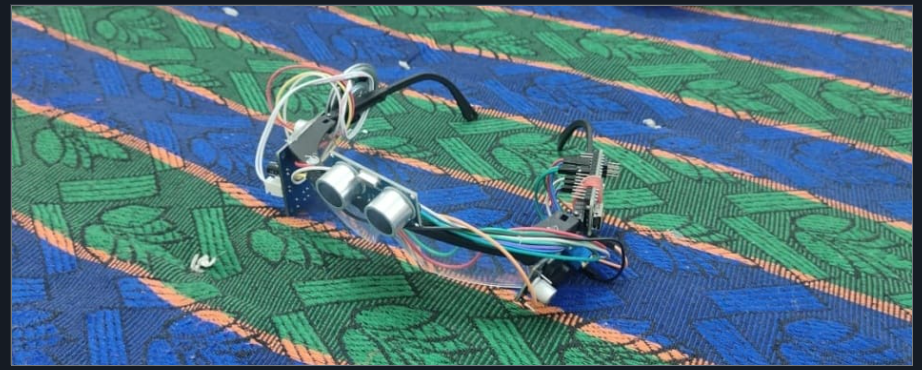

# Smart Glasses for Visually Impaired 👓

## 📌 Overview

This project helps visually impaired people detect nearby obstacles using ultrasonic sensors and alerts them using a buzzer.

## ⚙️ Components Used

* Arduino UNO
* Ultrasonic Sensor (HC-SR04)
* Buzzer
* Battery

## 🔧 Working Principle

* Sensor measures distance using ultrasonic waves
* If object distance < 100 cm → buzzer alerts
* Helps user avoid obstacles

## 🔌 Circuit Diagram

## 🖼️ Project Image

## 💻 Code

The Arduino code is available in the repository.

File: `Smart_glasses15a.ino`

## 📌 Applications

* Assistive device for visually impaired
* Obstacle detection system
* Wearable safety device

## 🚀 Future Improvements

* Add vibration motor
* Add AI object detection
* Use ESP32 for IoT features

## ✅ Conclusion

This project demonstrates how embedded systems can solve real-world accessibility problems.
